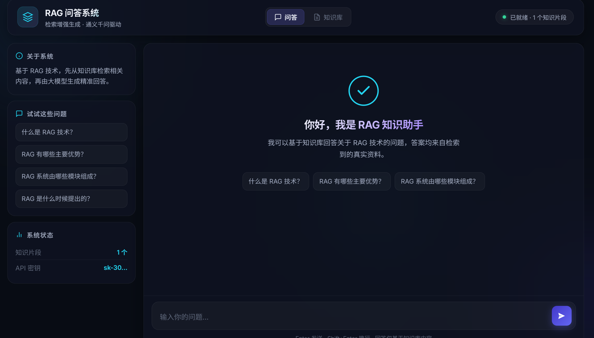
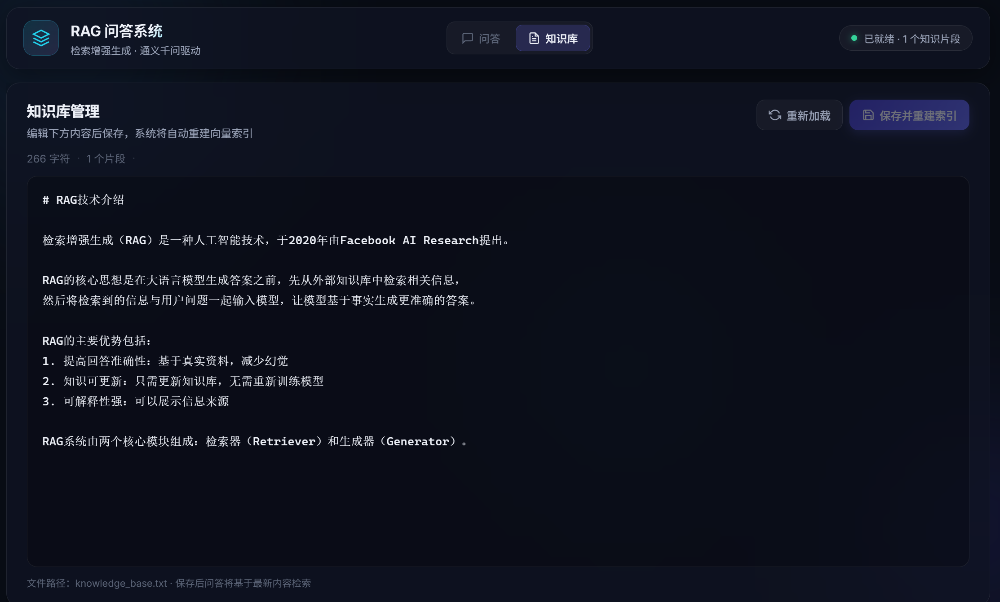

# 📚 RAG 知识库问答系统

> 一个基于RAG（langchain框架）技术的智能回答系统，可根据知识库（可修改）回答用户提问

## 🎯 项目简介
本项目实现了一个完整的RAG问答系统。用户可以在网页上向通义千问大模型提问，系统会先检索文档中的相关内容，再调用大模型基于知识库进行回答。

**核心特点**
- 知识库搜索：系统查询知识库后才调用大模型
- 交互友好：优美的前端页面
- 可更改知识库：用户可在网页上即时更改知识库内容，方便测试

## 🚀 快速开始

### 环境要求
- python环境
- 阿里云百炼 API Key（通义千问）

### 安装步骤

1.下载并解压压缩文件

2.安装依赖
pip install -r requirements.txt

3.配置API密钥
用记事本打开.env文件，在“=”右边加上自己的通义千问API Key
DASHSCOPE_API_KEY=sk-your-api-key-here

4.运行项目
1.运行.bat文件
2.（备用）用cmd打开文件目录所在地，输入python app.py运行

## 🖼️ 效果预览
>界面展示

>知识库修改展示

## 📝 AI 声明
本项目只是为了测试LangChain框架，所以在开发过程中大量借助了AI辅助工具（如deepseek、Cursor）进行：

- 代码优化与网页版生成和美化
- Bug分析与修改
- 说明文档美化
  
**核心逻辑**、**功能设计**和**说明撰写**由开发者独立完成

